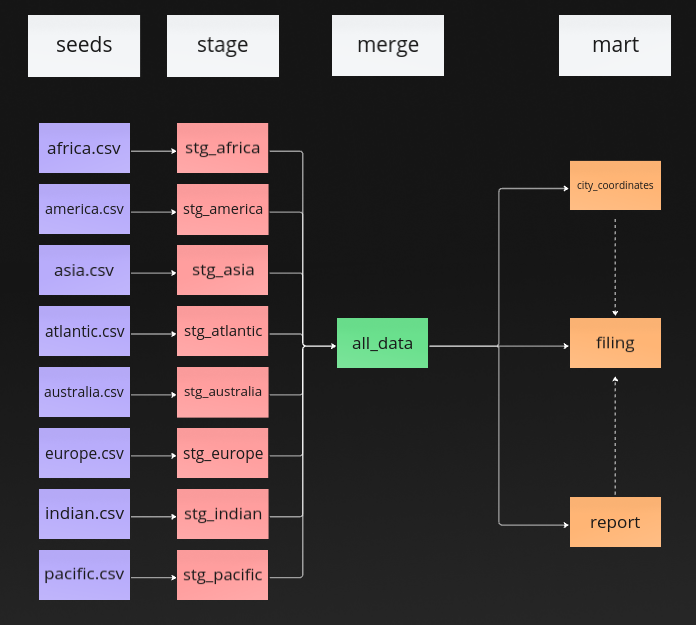
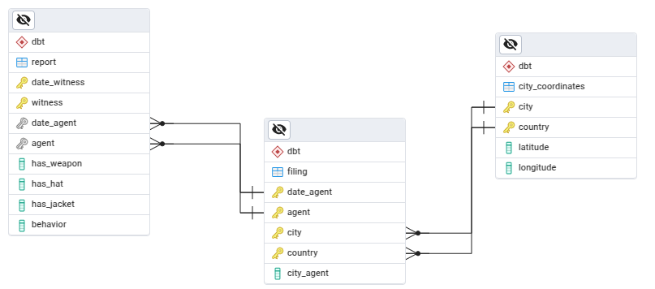
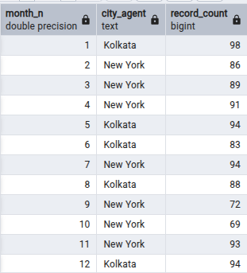
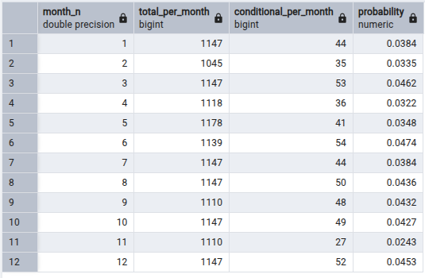
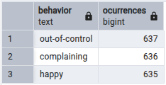
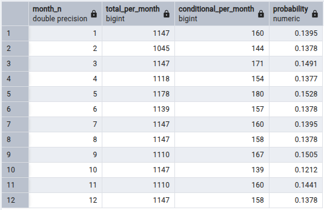

Welcome to your new dbt project!

# Skill Assessment: dbt Data Engineer
## Where in the World os Carming Sandiego?


### Description
This repository answers Cascade Debt's skill assessment.

### Installation:
 
To start, the following Docker commands can be helpful.
```console
sudo docker-compose build  
sudo docker-compose up -d
sudo docker-compose exec dbt dbt deps
sudo docker-compose exec dbt dbt seed
sudo docker-compose exec dbt dbt run

```

## Schema

### The schema consists of the following steps:


The schema contains the eight seed csv files. Stages are used to edit and normalize the column names. The column names are normalized with the macros `column_format.sql`.

Then all these stage views are merged.

### The detailed schema:


The schema contains three main tables. The `report` table that has the main information about the sightings.

The 'filing' contains information about `city_agent`. To keep this in 3NF, `city_agent` is not within `report` given that it depends on the `agent` and `city` + `country`.

Finally, the coordinates depend directly on the `city` and `country`. Hence `latitude` and `longitude` are separated.

## Analyses

### Questions A
#### For each month, which agency region is Carmen Sandiego most likely to be found?


This table has the month number. 1 being January.
It also provides the `record_count` or number of sightings.
The graph clearly shows Carmen Sandiego can be seen mainly in two cities, Kolkata and New York.

### Logic

The first thing to do is get the filings, extract the month from `date_witness`. Use GROUP BY for the `months` and `city_agent` columns. To that, order in descreasing order by number of reports per city per month. 

The next step is enumerate from 1 to n per `month` only. This way the highest instances will have 1.

Using the previous number with the enumerations. The last thing is to add a condition where the enumeration is 1. That provides the 'city_agent' with most reports.


### Questions B
#### Also for each month, what is the probability that Ms. Sandiego is armed AND wearing a jacket, bit NOT a hat? What general obsevations about Ms. Sandiego can you make from this?



This table also provides the total reports per month, as well as the reports matching the condition per month.

From the data, we can say the there is a low probability of seeing Carmen Sandiego with that particular description.

### Logic

Here again, we want to get the 'month', then group by month to get all the reports and adding a row count. 

The next thing is to also create a row count where only the row with the condition are counted. With these two values per month, the probability is calculated with the condition count divided by the total count per month.

### Questions C
#### What are the three most occuring behaviors of Ms. Sandiego?



The most comming being:

1. out of control
2. complaining
3. happy 

### Logic

This one is a bit simpler, a GROUP BY on `behavior` and adding a count would provide the results. Ordering by count in descreasing order and limiting to three rows provides the result.

### Questions D
#### For each month, what is the probability Ms. Sandiego exhibits one of her three most occurring behaviors?



Just like Question B, here we have the total reports per month and the one provided the condition.
There is a probability of around 13% of finding Ms. Sandiego with one of three most occuring behaviors.

### Logic

This is somewhat similar to Question B. We group by month and get the total reports and conditional reports. 

The only complicated part is getting the column values from Question C into the equation. For that, a new CASE column is created to verify if the row values is in Question C's answer. With that, we use a GROUP BY to count the condition where the CASE column is True.


